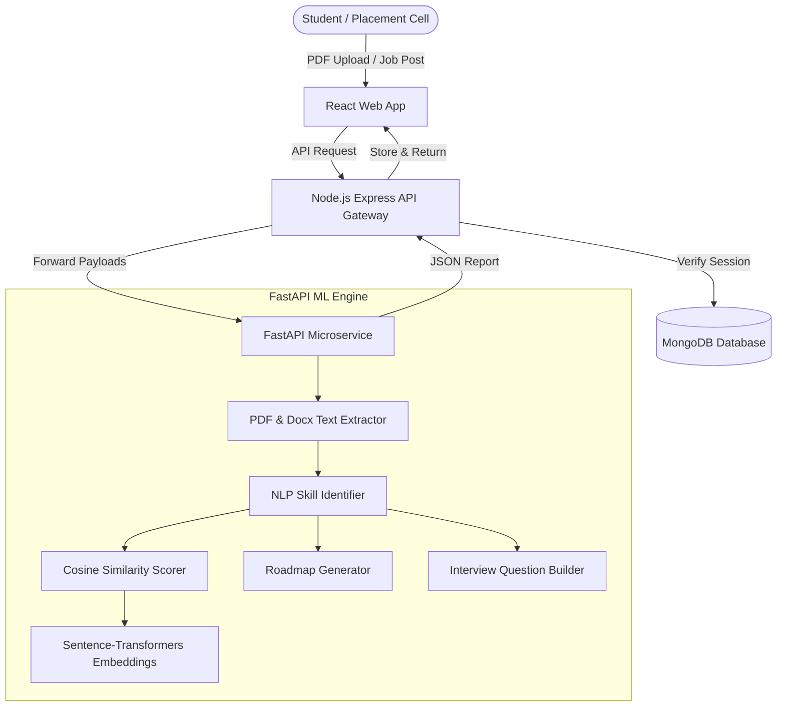

# SkillBridge AI - Hackathon Pitch Deck & Demo Outline

This document details the slide structure, talking points, and demo outline for presenting **SkillBridge AI** at the hackathon judging session.

---

## Slide Outline

### Slide 1: Title & Hook
- **Slide Title**: SkillBridge AI: Revolutionizing Campus Placements with AI
- **Subtitle**: Closing the Skill Gap between Student Portfolios and Industry Requirements
- **Team Names**: [Insert Team Members]
- **Visuals**: Logo mock-up, clean dark dashboard screenshot showing a "72% Job Match Score".

### Slide 2: Problem Statement
- **Headline**: The Graduation-to-Employment Gap
- **Key Points**:
  - **Information Asymmetry**: College students apply for dozens of job listings blindly without understanding how their resumes map to specific tech stacks.
  - **Low Conversion Rates**: Standard resumes get rejected by automated Applicant Tracking Systems (ATS) due to formatting errors or keyword mismatches.
  - **Inefficient Upskilling**: Students want to fill skill gaps but don't know where to start or what specific learning roadmaps look like.
  - **Placement Cells Overwhelmed**: College coordinators lack data-driven analytics to identify widespread campus skill deficits.

### Slide 3: The Solution
- **Headline**: SkillBridge AI: Your Career Co-Pilot
- **Core Workflow**:
  1. **Upload Resume**: Parsed using advanced NLP to extract skills, education, projects, and history.
  2. **Analyze Job**: Evaluates pasting criteria and compiles target skill matrices.
  3. **Calculate Fit**: Employs sentence embeddings and cosine similarity to rate Job Match, ATS Compatibility, and Employability.
  4. **Upskill Roadmap**: Generates interactive training timelines with curated resources.
  5. **Interview prep**: Creates mock questions based on the identified gap metrics.

### Slide 4: AI & Data Science Architecture
- **Headline**: Under the Hood: Machine Learning Pipeline
- **Core Components**:
  - **Document Parsing**: Regular expressions and section keyword mappings extract contacts, projects, and education.
  - **NLP Skill Taxonomy**: Dictionary-based matching identifies 100+ technical and soft skills.
  - **Semantic Embeddings**: Uses Sentence-Transformers (`all-MiniLM-L6-v2`) or TF-IDF models to map resumes and jobs into high-dimensional vector spaces, calculating cosine similarity.
  - **ATS Compliance Audits**: Checklists analyze structure, formatting bulletins, and contact metadata.
  - **Recommendation Engine**: Custom lookup vectors mapping missing skills to detailed tutorial steps.

### Slide 5: System Architecture Diagram

### Slide 6: Core Features (The Wow Factor)
- **Visual Dashboards**: High-impact Recharts visuals (Radar/Bar charts) demonstrating skill coverage.
- **ATS Checker**: Live grading feedback indicating missing layout structures.
- **Roadmap Checklist**: Interactive timelines letting students mark off learning steps (stored locally).
- **Mock Interview Coach**: Expandable technical, behavioral, and project-based questions.
- **Placement Analytics**: Aggregated graphs of common skill gaps (e.g. Docker, AWS) for training administrators.

### Slide 7: Value Proposition
- **For Students**: Direct insight into resume mismatches and personalized learning steps before applying, boosting conversion.
- **For College Administrators**: Automated diagnostic tool identifying campus-wide skill deficiencies to optimize elective courses and bootcamps.
- **For Recruiters**: Higher-quality candidates whose portfolios match exact team requirements.

---

## Live Demo Script (3 Minutes)

1. **Introduction (30s)**:
   - *"Hello judges, today we are presenting SkillBridge AI, a platform that helps college graduates go from applicant to interview list."*
   - Log in to the application.
2. **Uploading & Parsing (60s)**:
   - Navigate to the **Analyze Workspace**.
   - Drag and drop `sample_resume_john_doe.txt`. Point out the loading spinner: *"Our FastAPI backend uses NLP libraries to instantly pull out skills and experiences."*
   - Paste the `sample_job_full_stack.txt` (demanding React, TypeScript, Docker, Kubernetes).
   - Click **Perform Fit Matching**.
3. **Reviewing Dashboard (60s)**:
   - Walk through the scores: *"John gets a 65% Job Match. His resume highlights React/Node, but he lacks Docker and Kubernetes."*
   - Show the **ATS formatting warning**: *"We note he's missing his phone number or experience headers."*
   - Jump to the **Roadmap**: *"Instead of telling him he fails, we give him a timeline. Under 'Docker', he can check off 'Write a Dockerfile', with official docs and free tutorials linked."*
   - Open **Interview Prep**: *"We formulate mock questions like: 'What is the event loop in Node.js?' with recruiter hints so he can practice."*
   - Conclude: *"SkillBridge AI bridges the gap between student aspiration and corporate readiness."*
